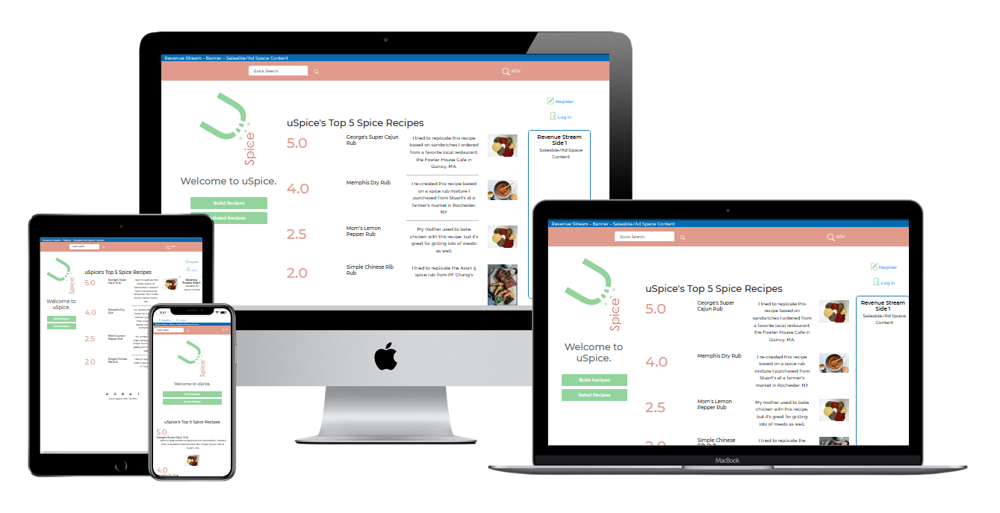

# George Lychock - MS4 Project: Unknown
### Salem State University Fullstack Software Developer Certificate
#### Django Module
-   [View Live Dev Site]()

<h1 align="center"></h1>

## Table of Contents

- [Use Case](#UC)
    - [User Stories](#US)
    - [Requirements](#REQS)
    - [Backlog (Future Requirements)](#BACKLOG)
- [UI/UX](#UXUI)
    - [UI](#UI)
        -   [Wireframes](#UIWF)
    - [UX - Design](#DES)
        -   [Wireframes](#UXWF)
- [Technical Background](#TECH)
- [Testing](TESTRM.md)
- [Known/Resolved Issues](#ISSUES)
- [Product/Project Management](#PROJ)
- [Deployment](#DPLY)
- [Credits](#CREDS)

-   ### Resources Used
    -   [MDN General Web Docs: ](https://developer.mozilla.org/) For semantic structure reference, arrays, localStorage, fetch.
    -   [W3Schools.com](https://www.w3schools.com/), For Color Picker, html/css/js general refernece, semantic structure reference, arrays, localStorage.
    -   [For Loop Examples from pythonguides.com:](pythonguides.com/python-for-loop-index/)
    -   [Changing the port setting for Django](https://pythonistaplanet.com/how-to-change-the-default-runserver-port-in-django/) I needed to chnage the port since I'm running my own dev environment and not GitPod